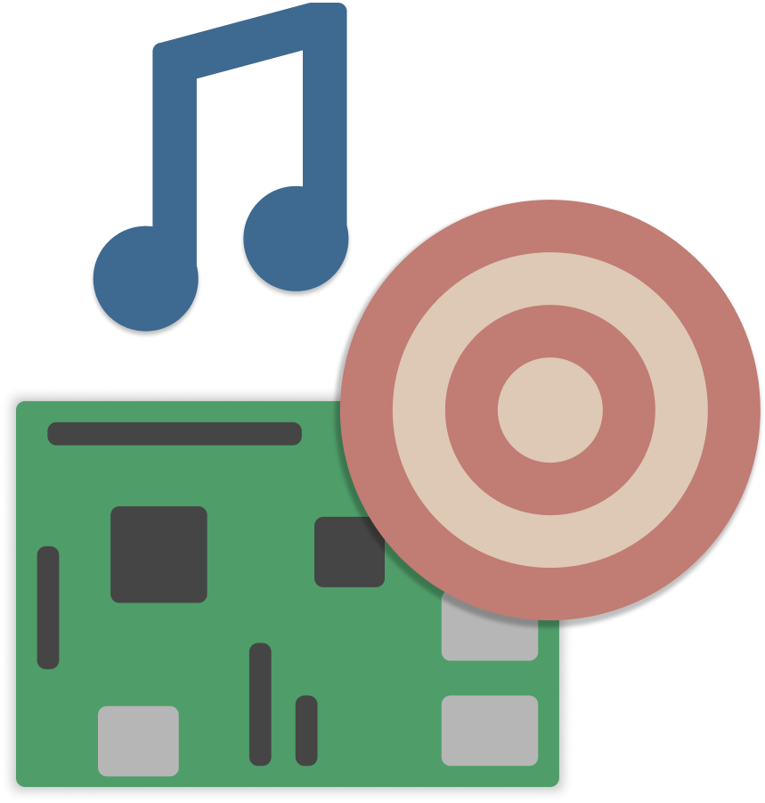

# PitRadio

PitRadio is an IoT project as part of the [PIT-Hackathon](https://github.com/PIT-Hackathon) 2021.

The goal of this project is to make a music player with a shared playlist that can be edited by everyone around. The Pi creates a private Wi-Fi network where clients can access a website hosted on the device to add and remove songs from the playlist using up- and down-votes.

